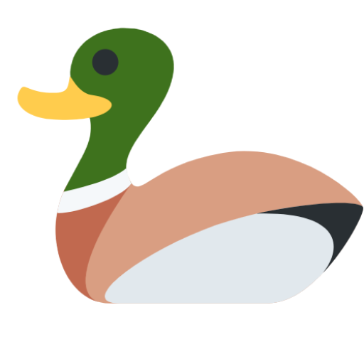

<!-- Improved compatibility of back to top link: See: https://github.com/othneildrew/Best-README-Template/pull/73 -->
<a id="readme-top"></a>
<!--
*** Thanks for checking out the Best-README-Template. If you have a suggestion
*** that would make this better, please fork the repo and create a pull request
*** or simply open an issue with the tag "enhancement".
*** Don't forget to give the project a star!
*** Thanks again! Now go create something AMAZING! :D
-->


<!-- PROJECT LOGO -->
<br />
<div align="center">
  <a href="https://github.com/vinc3w/DimeDuck">
    
  </a>
  <h3 align="center">DimeDuck</h3>
  <p align="center">A budget tracking app!</p>
</div>


<!-- ABOUT THE PROJECT -->
## About DimeDuck

![Product Name Screen Shot][dashboard.png]

**DimeDuck** is a simple and intuitive budget tracking app designed to help you take control of your finances. Whether you're managing monthly expenses, saving for a goal, or just trying to stay on top of your spending habits, this app provides the tools you need to make informed financial decisions.

With features like expense categorization, real-time balance tracking, and insightful spending reports, DimeDuck makes budgeting effortless and accessible. Built with usability and clarity in mind, it's perfect for individuals, students, or anyone looking to better manage their money.

Start tracking, stay on budget, and reach your financial goals — all in one place.

<p align="right">(<a href="#readme-top">back to top</a>)</p>


### Built With

All major frameworks/libraries used.

- [![React][React.js]][React-url]
- [![Material UI][Mui]][Mui-url]
- [![React Router][ReactRouter.js]][ReactRouter-url]
- [![Redux][Redux.js]][Redux-url]
- [![Express][Express.js]][Express-url]
- [![MongoDB][MongoDB]][MongoDB-url]
- [![Node][Node.js]][Node-url]

<p align="right">(<a href="#readme-top">back to top</a>)</p>


<!-- GETTING STARTED -->
## Getting Started

To get a local copy up and running follow these simple example steps.

### Installation

Follow the steps below to install the project.

1. Clone the repo
   ```sh
   git clone https://github.com/vinc3w/DimeDuck.git
   ```
2. Fill in the `.env` file in both server and client project
   ```env
   KEY=<Value>
   ```
3. Install server NPM packages and run
   ```sh
   cd app/server
   npm install
   npm run dev
   ```
4. Install client NPM packages and run in another terminal
   ```sh
   cd app/client
   npm install
   npm run dev
   ```

<p align="right">(<a href="#readme-top">back to top</a>)</p>


<!-- SCREENSHOTS EXAMPLES -->
## Screenshots

![Login][login.png]
![Dashboard][dashboard.png]
![Expenses][expenses.png]
![Settings][settings.png]

<p align="right">(<a href="#readme-top">back to top</a>)</p>


<!-- MARKDOWN LINKS & IMAGES -->
[logo.png]: assets/logo.png

[login.png]: assets/screenshots/login.png
[dashboard.png]: assets/screenshots/dashboard.png
[expenses.png]: assets/screenshots/expenses.png
[settings.png]: assets/screenshots/settings.png

[React.js]: https://img.shields.io/badge/React-61DAFB?style=flat&logo=react&logoColor=black
[React-url]: https://reactjs.org/
[MUI]: https://img.shields.io/badge/Mui-007FFF?style=flat&logo=mui&logoColor=white
[MUI-url]: https://mui.com/material-ui/
[ReactRouter.js]: https://img.shields.io/badge/React_Router-CA4245?style=flat&logo=react-router&logoColor=white
[ReactRouter-url]: https://reactjs.org/
[Redux.js]: https://img.shields.io/badge/Redux-764ABC?style=flat&logo=redux&logoColor=white
[Redux-url]: https://reactjs.org/
[Express.js]: https://img.shields.io/badge/express-20232A?style=flat&logo=express&logoColor=white
[Express-url]: https://expressjs.com/
[MongoDB]: https://img.shields.io/badge/MongoDB-47A248?style=flat&logo=mongodb&logoColor=white
[MongoDB-url]: https://www.mongodb.com/
[Node.js]: https://img.shields.io/badge/Node.js-339933?style=flat&logo=node.js&logoColor=white
[Node-url]: https://nodejs.org/
